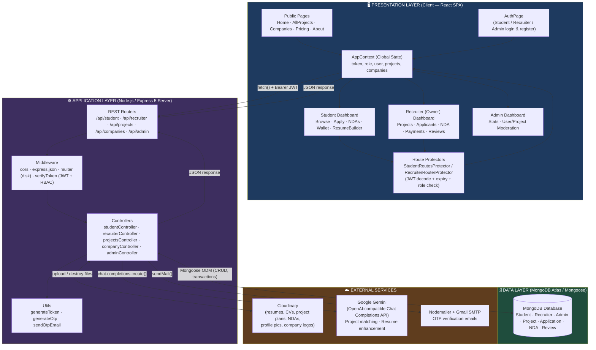
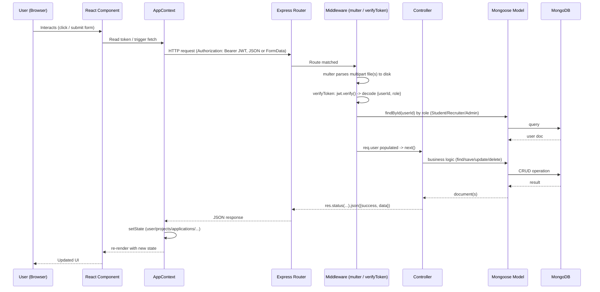
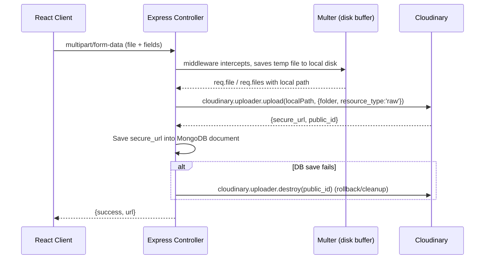
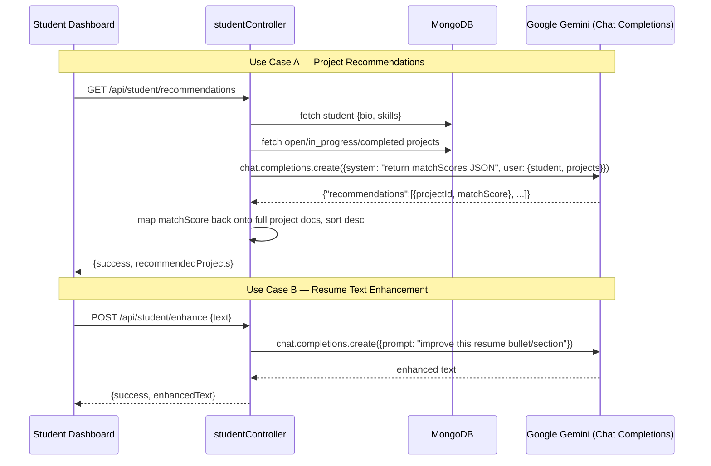
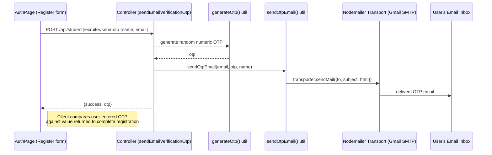
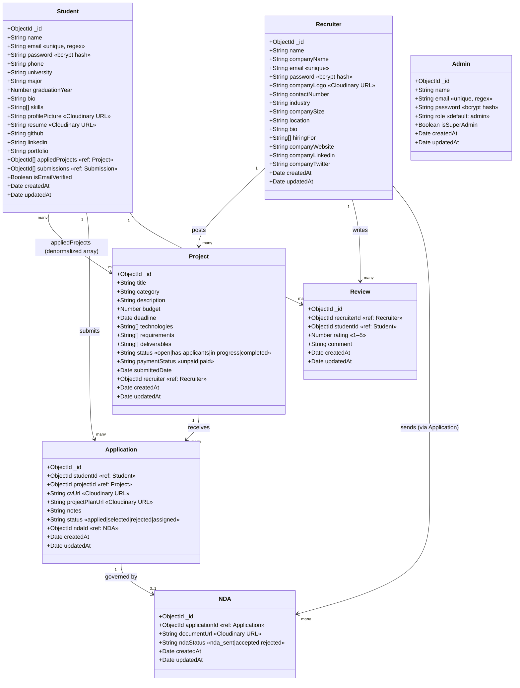
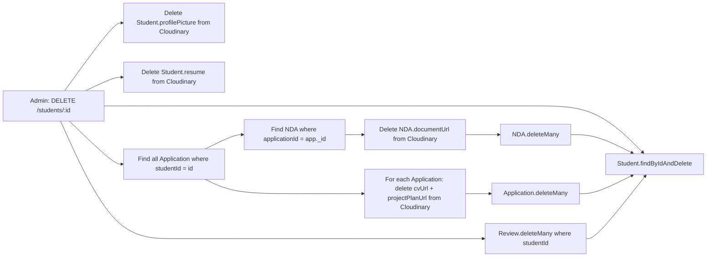
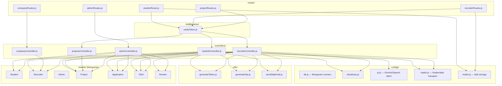
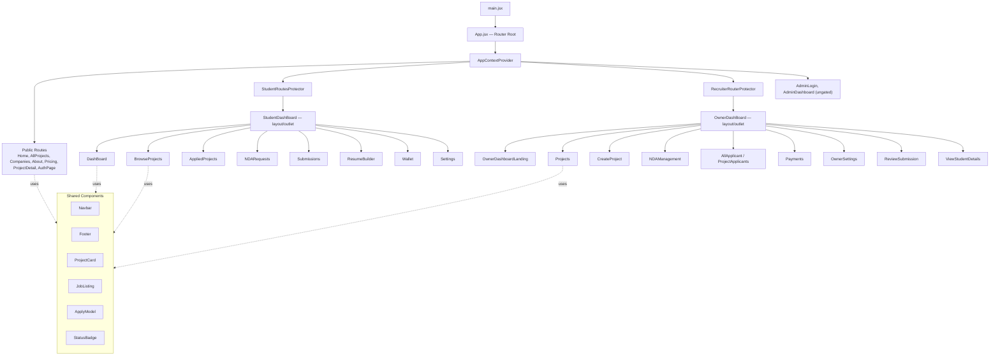
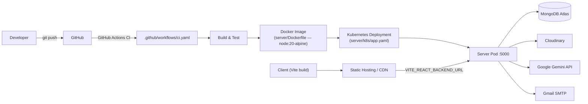

# InsiderJobs — System Design Document

> A full-stack freelancing/internship marketplace connecting **Students** with **Recruiters (Companies)**, moderated by an **Admin**, with AI-assisted project matching.

---

## 1. Overview

InsiderJobs is a MERN-based platform (MongoDB, Express, React, Node.js) where:

- **Recruiters** post projects (gigs) with budgets, deadlines, and requirements.
- **Students** browse/receive AI-recommended projects, apply with a CV + project plan, sign NDAs, get assigned, and get paid/reviewed on completion.
- **Admins** moderate the platform (analytics, user/project/application/NDA management, cascading deletes).

### 1.1 Tech Stack

| Layer | Technology |
|---|---|
| Presentation (Client) | React 19, React Router v7, Vite 7, Tailwind CSS v4, Recharts, GSAP/AOS (animation), Axios/Fetch |
| Application (Server) | Node.js, Express 5, JWT (`jsonwebtoken`), `bcrypt`, `multer` (file uploads) |
| Database | MongoDB with Mongoose 8 ODM |
| External Services | Cloudinary (file/image storage), Google Gemini (via OpenAI-compatible SDK) for AI matching & resume enhancement, Nodemailer (Gmail SMTP) for OTP emails |
| Deployment | Docker (server Dockerfile), Kubernetes (`server/k8s/app.yaml`), GitHub Actions CI (`.github/workflows/ci.yaml`) |

### 1.2 User Roles

1. **Student** — the talent supplying labor.
2. **Recruiter** — represents a company; posts and manages projects.
3. **Admin** — platform super-user with full moderation rights.

---

## 2. High-Level Architecture (3-Tier + External Services)

The system follows a classic **3-tier architecture**: Presentation → Application → Data, with the Application tier fanning out to three external SaaS integrations.



**Key architectural notes:**
- The client is a **Single Page Application**; all navigation between roles is client-side routed with `react-router-dom`, and access is gated by `<RouteProtector>` wrapper components that decode the JWT locally (no server round-trip needed to gate a route).
- The server is **stateless** — every protected request carries a `Bearer <JWT>` header; there is no server-side session store.
- `AppContext` is the single source of truth on the client: it holds the JWT, decoded role, hydrated user profile, and shared lists (`projects`, `companies`, `allApplicants`, `recommendedProjects`), fetched via `useEffect` hooks and exposed to all components via React Context.
- The Application layer never talks to external services directly from routes — always through controllers, keeping Cloudinary/Gemini/SMTP credentials and logic encapsulated in `server/configs/*.js`.

---

## 3. Request Lifecycle (Presentation ↔ Application ↔ Data)

Generic path every request takes through the stack:



---

## 4. External Service Integrations

### 4.1 Cloudinary — File & Media Storage

Used for every binary asset in the system: student resumes, profile pictures, company logos, application CVs, project plans, and signed NDA documents.



- Config: `server/configs/cloudinary.js` (cloud name, API key/secret from env).
- Folders used: `applications/cvs`, `applications/plans`, NDAs, profile pictures, company logos — organized by `resource_type: 'raw'` for documents.
- **Transactional safety**: in flows like `applyProject`, uploads happen before the MongoDB write; if the Mongoose `session.commitTransaction()` fails, the controller calls Cloudinary cleanup to delete the orphaned uploaded files, preventing storage leaks.
- Cascading deletes (Admin deleting a Student) also cascade into Cloudinary — every associated file (resume, profile picture, CVs, plans, NDAs) is destroyed before the corresponding MongoDB documents are removed.

### 4.2 Google Gemini — AI Matching & Resume Enhancement

Accessed through the **OpenAI-compatible SDK** pointed at Google's Gemini endpoint (`server/configs/ai.js`):

```js
const ai = new OpenAI({
  apiKey: process.env.GEMINI_API_KEY,
  baseURL: process.env.GEMINI_BASE_URL,
});
```

Two use cases:



- Response is constrained with `response_format: { type: "json_object" }` for the recommendation endpoint so the server can safely `JSON.parse()` it.
- Model name is configurable via `process.env.GEMINI_MODEL`.

### 4.3 Nodemailer — OTP Email Delivery



- Config: `server/configs/mailer.js` — uses `nodemailer.createTransport({service:'gmail', auth:{user, pass}})` with `SMTP_USER` / app-specific `SMTP_PASS` from env.

---

## 5. Database Design — UML Class / ER Diagram

MongoDB is schema-flexible, but Mongoose enforces a consistent structure. The diagram below models each collection as a class (with types & key constraints) and shows relationships as they are actually implemented (via `ObjectId` refs and application-level joins).



### 5.1 Relationship Notes

| Relationship | Type | Implementation Detail |
|---|---|---|
| Recruiter → Project | 1 : N | `Project.recruiter` stores the owning recruiter's `ObjectId`. A recruiter can post many projects. |
| Student → Project | M : N | Modeled two ways: `Student.appliedProjects[]` (denormalized convenience array) **and** the authoritative `Application` join collection. |
| Student ↔ Project → Application | Join Entity | `Application` is the true many-to-many join table between `Student` and `Project`, carrying its own attributes (`cvUrl`, `status`, `notes`). |
| Application → NDA | 1 : 0..1 | An application optionally has one NDA once the recruiter sends one; `Application.ndaId` and `NDA.applicationId` form a bidirectional-ish link (NDA is the primary FK holder; `Application.ndaId` is a denormalized back-reference). |
| Recruiter → Review ← Student | N : N via Review | `Review` is a join entity: a recruiter rates a student per completed project engagement. |
| Student.submissions[] | 1 : N (referenced, unimplemented) | Schema references a `Submission` model that does not currently exist in `server/models/` — a placeholder for a future "Submissions" feature (client has a `Submissions.jsx` page already scaffolded). |

### 5.2 Cascading Delete Graph (Admin moderation)



---

## 6. Backend Component Architecture



### 6.1 REST API Surface

| Resource | Method & Path | Auth | Purpose |
|---|---|---|---|
| **Student** | `POST /api/student/send-otp` | Public | Send email verification OTP |
| | `POST /api/student/register` | Public (+file: resume) | Register new student |
| | `POST /api/student/login` | Public | Login, returns JWT |
| | `GET /api/student/profile` | JWT | Get own profile |
| | `PUT /api/student/update-profile` | JWT (+files) | Update profile/resume/pic |
| | `POST /api/student/change-password` | JWT | Change password |
| | `POST /api/student/enhance` | Public | AI resume text enhancement (Gemini) |
| | `POST /api/student/apply-project` | JWT (+files) | Apply with CV + plan (Cloudinary + transaction) |
| | `GET /api/student/applied-projects` | JWT | List own applications |
| | `GET /api/student/recommendations` | JWT | AI-matched project list (Gemini) |
| | `GET /api/student/ndas` | JWT | List NDAs sent to student |
| | `PUT /api/student/upload-nda` | JWT (+file) | Upload signed NDA |
| | `GET /api/student/stats` , `/wallet` | JWT | Dashboard stats / earnings |
| **Recruiter** | `POST /send-otp`, `/register` (+logo), `/login` | Public | Onboarding |
| | `POST /create-project`, `PUT /update-project/:id`, `DELETE /delete-project/:id` | JWT | Project CRUD |
| | `GET /profile`, `PUT /update-profile`, `POST /change-password` | JWT | Account management |
| | `GET /project-applicants`, `POST /applicant-details` | JWT | Applicant tracking |
| | `POST /send-nda` (+file), `GET /ndas` | JWT | NDA lifecycle |
| | `POST /assign-project` | JWT | Assign + auto-reject competitors |
| | `GET /assigned-projects`, `POST /process-payment` | JWT | Payments |
| | `POST /submit-review`, `GET /student-reviews/:id` | JWT | Reviews |
| | `GET /stats` | JWT | Dashboard analytics |
| **Projects (public)** | `GET /api/projects` | Public | List all projects |
| | `GET /api/projects/:recruiterId` | JWT | Projects by recruiter |
| | `GET /api/projects/project/:projectId` | JWT | Single project detail |
| **Companies** | `GET /api/companies` | Public | List all recruiters/companies |
| **Admin** | `POST /register`, `POST /login`, `GET /profile` | Public* | Admin auth |
| | `GET /stats` | — | Platform-wide analytics |
| | `GET /students`, `DELETE /students/:id` | — | Student moderation (cascading delete) |
| | `GET /recruiters`, `DELETE /recruiters/:id` | — | Recruiter moderation |
| | `GET /projects`, `DELETE /projects/:id` | — | Project moderation |
| | `GET /applications`, `GET /ndas` | — | Global visibility |

\* Admin routes currently lack `verifyToken` middleware attached in code (commented out placeholder for `authAdmin`) — see **Section 8: Security Observations**.

---

## 7. Frontend Component Architecture



- **Route protection** is purely client-side: `StudentRoutesProtector` / `RecruiterRouterProtector` decode the JWT with `jwt-decode`, check expiry and `role`, and redirect via `<Navigate>` if invalid — actual authorization is still enforced server-side by `verifyToken` on each API call.
- **State hydration**: on mount, `AppContext` decodes the stored token, sets a `setTimeout` for auto-logout at expiry, then fetches the role-specific profile (`/profile`), all projects, all companies, and (conditionally) applications or AI recommendations.

---

## 8. Security Observations (for awareness, not implemented changes)

These are descriptive notes on the current implementation, not requested fixes:

- **Admin routes are unauthenticated** — `adminRoutes.js` has no `verifyToken`/`authAdmin` middleware wired in (comment says "Add authentication middleware if needed"), meaning `/api/admin/*` endpoints are currently open to any caller.
- **OTP returned in API response** — `sendEmailVerificationOtp` returns the `otp` value directly in the JSON response (`{success, message, otp}`), which is presumably for client-side comparison, but it should ideally never leave the server — an attacker who intercepts the response could complete verification without reading the email.
- **CORS is fully open** — `app.use(cors())` with no origin allow-list.

---

## 9. Deployment Topology



---

## 10. Summary

InsiderJobs cleanly separates concerns across three tiers:

1. **Presentation** — a React SPA with context-based global state and client-side route guarding.
2. **Application** — a stateless Express REST API using JWT for auth, Mongoose for persistence, and dedicated config modules to isolate third-party integrations (Cloudinary, Gemini, Nodemailer).
3. **Data** — MongoDB collections connected through explicit `ObjectId` references, with `Application` and `Review` acting as join entities for the platform's core many-to-many relationships (Student↔Project, Recruiter↔Student).

External services are integrated at the controller layer only, keeping the boundary between "our" persisted data and third-party SaaS calls explicit and auditable.